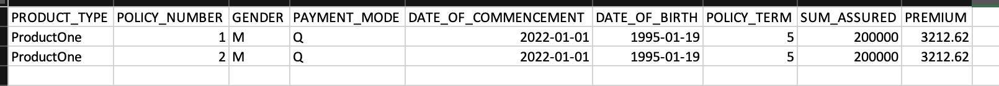
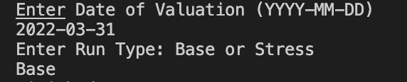
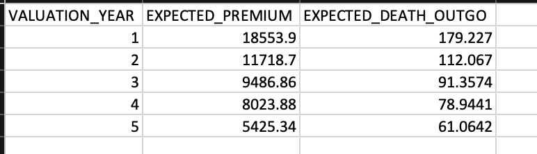

# Actuarial Cash-flows Projection Application

## Overview
For the capstone project of the Udactiy Nanodegree programme, I have built an actuarial cash-flows projection application making use of object oriented programming and multi-threading. 

In return for regular premium payments over the duration of the policy term, a life insurance policy (Term-Assurance policy) pays a sum to an insured upon death during that term (the sum-assured). It is not certain when a sum-assured payment may result and consequently when the premium inflows stop. For an insurer to gain better understanding of when these cash-flows may result and confirm whether sufficient funds are held to meet future sum-assured payments, it is necessary to project the __likely__ cash-flows into the future using assumed mortality (probability of death) and lapse rates (the probability of a policy being cancelled as a result of not paying premiums).

This application takes in a group of Term-Assurance policies from a csv file, and projects, for each policy, the __likely monthly cash-flows__ from date of valuation (set by user), upto the date of maturity of that policy. This is performed under one of two scenarios (set by user); a base scenario or a stress scenario which change the mortality and lapse rates. The cash-flows for each policy are then __grouped by the year of projection__, and added together to __produce portfolio yearly cash-flows__, which is then returned as a csv file. 

## File and Class Structure
This repository contains:
- `data/` : Contains the assumed mortality rates csv file, the lapse rates csv file, and the sample policies csv file on which the projection is to be run.

- `include/` : Contains the header files, `Valuation.h`, `MortalityRates.h`, `LapseRates.h`, `Policy.h`, `TimeStepProjection.h`, `DecrementsProjection.h`, `CashFlowsProjection.h`, `CashFlowsProjectionByValuationYear.h`, and `PortfolioCashFlows.h` files.

- `results/` : The output csv file of the program, `portfolioCashFlowsByValuationYear.csv`, will be generated and saved here.

- `src/` : Source. Contains the `main.cpp`, `Valuation.cpp`, `MortalityRates.cpp`, `LapseRates.cpp`, `Policy.cpp`, `TimeStepProjection.cpp`, `DecrementsProjection.cpp`, `CashFlowsProjection.cpp`, `CashFlowsProjectionByValuationYear.cpp`, and `PortfolioCashFlows.cpp` files.

- `CMakeLists.txt` : cmake configuration file

- `README.md` : This file

- `expectedOutput/` : Constains the images used in the Readme.

1. `Valuation.h/Valuation.cpp`:
    
    The purpose of the Valuation Class is to hold the date of valuation 
    (i.e. the time point from which cash-flows will be projected into the future),
    and to indicate the run type - i.e. the cashflows are projected under the base scenario 
    or the stress scenario (the mortality rates and lapse rates that are used would differ depending on base or stress).
2. `MortalityRates.h/MortalityRates.cpp`:

    The purpose of this class is to encapsulate the base mortality rate table (yearly),
    hold the applicable loading on the base rates (which differs based on whether base or stress runType from Valuation Class), 
    and to create the independent monthly loading-applied mortality rates based on the run type

3. `LapseRates.h/LapseRates.cpp`:

    The purpose of this class is to encapsulate the base lapse rate table (yearly),
    hold the applicable loading on the base rates (which differes based on whether base or stress runType from Valuation Class), 
    and to create the independent monthly loading-applied lapse rates based on the run type.

4. `Policy.h/Policy.cpp`:

    The purpose of this class is to instantiate 
    a `Policy` object from the policy data,
    and add further attributes such as the date of maturity,
    duration in-force, duration outstanding. 
   
    It is composed of a `Valuation` object.

5. `TimeStepProjection.h/TimeStepProjection.cpp`:

    The purpose of this class is to project, and store, for each `Policy` object the following:
    1. timeStep - vector of integers from 1 to the durationOutstanding.
    2. date - vector of monthly dates starting from the dateOfValuation and ending with dateOfValuation + (months = last element of timeStep)
    3. premiumIndicator - vector of ones or zeros depending on whether a premium payment is expected on that date.
    4. policyYear - vector of integers; at each date, we calculate the the time from dateOfCommencement to that date (i.e. the policyYear)
    5. valuationYear - similar to policyYear, except we calculate the length of time from dateOfValuation.
    6. ageNearest - vector of integers; at each date, we calculate the age using the dateOfBirth.
    
    It is composed of a `Policy` object.

    The `run()` function invokes all the functions necessary to perform the above.

6. `DecrementsProjection.h/DecrementsProjection.cpp`:

    The purpose of this class is to project, and store, for each `TimeStepProjection` object:
    1. The probability of being alive at the start of each time step. At time step 1, this probability is 1. 
    2. The probability of dying between the start of each time step and the end of that same time step (for example, between the start of time step 1 and end of time step 1/start of time step 2).
    3. The probability of a lapse (cancelled policy due to non premium payment) between the start of each time step and the end of that same time step (for example, between the start of time step 1 and end of time step 1/start of time step 2).
    4. The probabilty of being alive at the end of each time step (for example, end of time step 1/start of time step 2). This is equal to points, 1 - 2 - 3. The probability of being alive at the start of next time step is equal to the probability of being alive at the end of the previous time step. 
    

    It is composed of a `TimeStepProjection`, a `MortalityRates` and a `LapseRates` object.

    The `run()` function invokes all the functions necessary to perform the above.

7. `CashFlowsProjection.h/CashFlowsProjection.cpp`

    The purpose of this class is to project and store cashflows and __expected__ cashflows for each `DecrementsProjection` object.

    It is composed of a `DecrementsProjection` object.

    The `run()` function invokes all the functions necessary to perform the above.

8. `CashFlowsProjectionByValuationYear.h/CashFlowsProjectionByValuationYear.cpp`:

    The purpose of this class is to group the monthly cashflows from the `CashFlowsProjection` Class
    by valuationYear.

    It is composed of a `CashFlowsProjection` object.

    The `run()` function invokes all the functions necessary to perform the above.

9. `PortfolioCashFlows.h/PortfolioCashFlows.cpp`

    This class acts as a holding class for all instances of `Policy`, `TimeStepProjection`, `DecrementsProjection`, `CashFlowsProjection`, and `CashFlowsProjectionByValuationYear`.
    
    The purpose of this class is to take all the instances of `CashFlowsProjectionByValuationYear`, and create one set of yearly cash-flows i.e. the addition of the individual instances. 

    The `run()` function invokes all the functions necessary to perform the above.

10. `main.cpp`:

    In main, we instantiate a `PortfolioCashFlows` object, a `Valuation` object, a `MortalityRates` object and a `LapseRates` object. We also read in the policy data. 

    Next we instantiate `Policy` objects and push them into a vector of `Policy` objects in `PortfolioCashFlows` using `std::async`. We wait for the threads to finish.

    Next, we create `TimeStepProjection` objects using the `Policy` objects and push them into a vector of `TimeStepProjection` objects in `PortfolioCashFlows` using `std::async`. We wait for the threads to finish.
    We invoke the `run()` function on each element of the `TimeStepProjection` vector using `std::async`. We wait for the threads to finish.

    Next, we create `DecrementsProjection` objects using the `TimeStepProjection` objects, and the single `MortalityRates` and `LapseRates` objects, and push them into a vector of `DecrementsProjection` objects in `PortfolioCashFlows` using `std::async`. We wait for the threads to finish.
    We invoke the `run()` function on each element of the `DecrementsProjection` vector using `std::async`. We wait for the threads to finish.

    Next, we create `CashFlowsProjection` objects using the `DecrementsProjection` objects and push them into a vector of `CashFlowsProjection` objects in `PortfolioCashFlows` using `std::async`. We wait for the threads to finish.
    We invoke the `run()` function on each element of the `CashFlowsProjection` vector using `std::async`. We wait for the threads to finish.

    Next, we create `CashFlowsProjectionByValuationYear` objects using the `CashFlowsProjection` objects and push them into a vector of `CashFlowsProjectionByValuationYear` objects in `PortfolioCashFlows` using `std::async`. We wait for the threads to finish.
    We invoke the `run()` function on each element of the `CashFlowsProjectionByValuationYear` vector using `std::async`. We wait for the threads to finish.

    Finally, we invoke the `run()` function on the `PortfolioCashFlows` object. This will print the results out to the `results/` folder. 

## Dependencies for Running Locally
* cmake >= 3.11.3
  * All OSes: [click here for installation instructions](https://cmake.org/install/)
* make >= 4.1 (Linux, Mac), 3.81 (Windows)
  * Linux: make is installed by default on most Linux distros
  * Mac: [install Xcode command line tools to get make](https://developer.apple.com/xcode/features/)
  * Windows: [Click here for installation instructions](http://gnuwin32.sourceforge.net/packages/make.htm)
* Boost >= 1.7.x
  * Boost can be downloaded [here](https://www.boost.org/users/download/)
* gcc/g++ >= 5.4
  * Linux: gcc / g++ is installed by default on most Linux distros
  * Mac: same deal as make - [install Xcode command line tools](https://developer.apple.com/xcode/features/)
  * Windows: recommend using [MinGW](http://www.mingw.org/)

## Build Instructions

1. Clone this repo
2. Make a build directory in the top level directory: `mkdir build && cd build`
3. Compile: `cmake.. && make`
4. Run it: `./goSAM`

## Expected Behaviour
For 2 identical policies (found in the `data/` folder) with the following attributes:
- Date of commencement - 2022-01-01
- Date of birth - 1995-01-19
- Policy term - 5 years
- Sum assured - 200 000
- Payment mode - Quarterly premium payments (4 payments per year)
- Premium - 3212.62 per quarter 
- Gender - Male

and a valuation date and run type as below (prompted in terminal and requires user input):

The expected output (found in the `results/` folder) is:

## The Rubric Points Addressed 

__README (All Rubric Points REQUIRED)__

|DONE | CRITERIA | MEETS SPECIFICATIONS| WHERE |
|-- | -- | --| -- |
| :heavy_check_mark: | A README with instructions is included with the project |The README is included with the project and has instructions for building/running the project. If any additional libraries are needed to run the project, these are indicated with cross-platform installation instructions. You can submit your writeup as markdown or pdf.| |
| :heavy_check_mark: | The README indicates which project is chosen. | The README describes the project you have built. The README also indicates the file and class structure, along with the expected behavior or output of the program. | |
| :heavy_check_mark: | The README includes information about each rubric point addressed. | The README indicates which rubric points are addressed. The README also indicates where in the code (i.e. files and line numbers) that the rubric points are addressed. | |

__Compiling and Testing (All Rubric Points REQUIRED)__

|DONE | CRITERIA | MEETS SPECIFICATIONS| WHERE |
|-- | -- | --| -- |
| :heavy_check_mark: | The submission must compile and run. | The project code must compile and run without errors. We strongly recommend using cmake and make, as provided in the starter repos. If you choose another build system, the code must compile on any reviewer platform. |

__Loops, Functions, I/O__

|DONE | CRITERIA | MEETS SPECIFICATIONS| WHERE |
|-- | -- | --| -- |
| :heavy_check_mark: | The project demonstrates an understanding of C++ functions and control structures.| A variety of control structures are used in the project. The project code is clearly organized into functions.| Every .cpp file |
| :heavy_check_mark: | The project reads data from a file and process the data, or the program writes data to a file. | The project reads data from an external file or writes data to a file as part of the necessary operation of the program.| Reads policy data from `data` folder in `main.cpp` (line 72). Data is written out to a csv file in results folder in `main.cpp` (line 195).   |
| :heavy_check_mark: | The project accepts user input and processes the input.|The project accepts input from a user as part of the necessary operation of the program.|  When the application is executed, the user is prompted to enter the `Date Of Valuation` and `Run Type`

__Object Oriented Programming__

|DONE | CRITERIA | MEETS SPECIFICATIONS| WHERE |
|-- | -- | --| -- |
| :heavy_check_mark: | The project uses Object Oriented Programming techniques. | The project code is organized into classes with class attributes to hold the data, and class methods to perform tasks. | All .cpp and .h files |
| :heavy_check_mark: | Classes use appropriate access specifiers for class members. | All class data members are explicitly specified as public, protected, or private.| All .cpp and .h files |
|  | Class constructors utilize member initialization lists. | All class members that are set to argument values are initialized through member initialization lists.|  |
| :heavy_check_mark: | Classes abstract implementation details from their interfaces. | All class member functions document their effects, either through function names, comments, or formal documentation. Member functions do not change program state in undocumented ways.| All .cpp and .h files |
| :heavy_check_mark: | Classes encapsulate behavior. | Appropriate data and functions are grouped into classes. Member data that is subject to an invariant is hidden from the user. State is accessed via member functions.| All .cpp and .h files |
| | Classes follow an appropriate inheritance hierarchy. | Inheritance hierarchies are logical. Composition is used instead of inheritance when appropriate. Abstract classes are composed of pure virtual functions. Override functions are specified.|  |
|  | Overloaded functions allow the same function to operate on different parameters. |  |
|  | Derived class functions override virtual base class functions. |One member function in an inherited class overrides a virtual base class member function.| |
|  | Templates generalize functions in the project. | One function is declared with a template that allows it to accept a generic parameter.| |

__Memory Management__

|DONE | CRITERIA | MEETS SPECIFICATIONS| WHERE |
|-- | -- | --| -- |
| :heavy_check_mark: | The project makes use of references in function declarations. | At least two variables are defined as references, or two functions use pass-by-reference in the project code.|Extensively done so in multiple functions in `main.cpp`. Most classes are composed of objects of other classes. We define these variables as references. For example, `TimeStepProjection.h` is composed of a `Policy` object. The variable has been defined as a reference.|
|  | The project uses destructors appropriately. | At least one class that uses unmanaged dynamically allocated memory, along with any class that otherwise needs to modify state upon the termination of an object, uses a destructor. | |
|  | The project uses scope / Resource Acquisition Is Initialization (RAII) where appropriate. | The project follows the Resource Acquisition Is Initialization pattern where appropriate, by allocating objects at compile-time, initializing objects when they are declared, and utilizing scope to ensure their automatic destruction.| |
|  | The project follows the Rule of 5. | For all classes, if any one of the copy constructor, copy assignment operator, move constructor, move assignment operator, and destructor are defined, then all of these functions are defined.| |
|  | The project uses move semantics to move data, instead of copying it, where possible. | For classes with move constructors, the project returns objects of that class by value, and relies on the move constructor, instead of copying the object. |  |
| :heavy_check_mark: | The project uses smart pointers instead of raw pointers. | The project uses at least one smart pointer: unique_ptr, shared_ptr, or weak_ptr. The project does not use raw pointers.| used in `main.cpp` (line 49) |

__Concurrency__

|DONE | CRITERIA | MEETS SPECIFICATIONS| WHERE |
|-- | -- | --| -- |
| :heavy_check_mark: | The project uses multithreading. | The project uses multiple threads in the execution.| used extensively in `main.cpp` |
|  | A promise and future is used in the project. | A promise and future is used to pass data from a worker thread to a parent thread in the project code.| |
| :heavy_check_mark: | A mutex or lock is used in the project. | A mutex or lock (e.g. std::lock_guard or `std::unique_lock)` is used to protect data that is shared across multiple threads in the project code.| used in `PortfolioCashFlows.cpp` extensively |
|  | A condition variable is used in the project. | A std::condition_variable is used in the project code to synchronize thread execution.| |